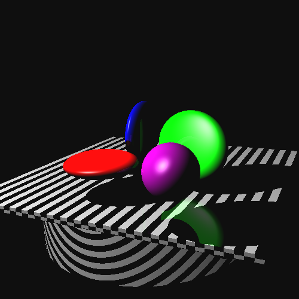

Program: Ray Tracer using Coin3D
Author: Aaron Albin
Date: 3/10/2012

To run the program, use 

<code>
executable <input.iv> <output.ppm> <xres> <yres> <final_scene_on> 
</code>

where final_scene_on should be set to 1 when reading the file "final.iv".

The final scene contains three ellipsoid spheres, one perfect sphere, one rectangular box and one cone.

